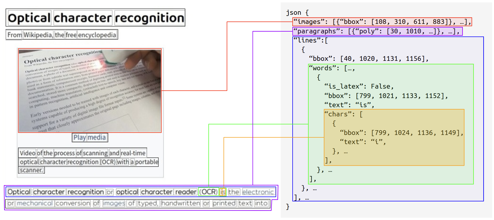

<div align="center">
    
# WEBVICOB 🕸 : Web-based Visual Corpus Builder

[](https://arxiv.org/abs/2211.03256)
[](#)

Official Implementation of **Web**-based **Vi**sual **Co**rpus **B**uilder (**WEBVICOB**)

</div>

## Introduction

**WEBVICOB** 🕸, **Web**-based **Vi**sual **Co**rpus **B**uilder, is a dataset generator that can readily construct a large-scale visual corpus (i.e., images with text annotations) from a raw Wikipedia HTML dump. The constructed visual corpora can be utilized in building Visual Document Understanding (VDU) backbones. Our technical Report, which describes our engine in detail and provides full experimental results and analyses, can be found here:<br>
> [**On Web-based Visual Corpus Construction for Visual Document Understanding**](https://arxiv.org/abs/2211.03256).<br>
> [Donghyun Kim](https://github.com/dhkim0225), [Teakgyu Hong](https://dblp.org/pid/183/0952.html), [Moonbin Yim](https://github.com/moonbings), [Yoonsik Kim](https://scholar.google.com/citations?user=nuxd_BsAAAAJ) and [Geewook Kim](https://geewook.kim).



## Updates
**_2023-05-03_** Our paper is accepted at ICDAR2023. A new version of the paper has been published on arxiv.  
**_2023-02-11_** HTML Section Chunker added, Solve memory-leak issue.  
**_2022-11-08_** [Paper](https://arxiv.org/abs/2211.03256) published on arxiv.    
**_2022-11-04_** First Commit, We release the codebase.  

## How to Use

### Environment
python >= 3.8

##### Init submodule (google font)
We use GoogleFonts for various visual information. (font/google)  
Init submodule if you want to use it.     

```bash
$ git submodule update --init --recursive
```

##### Install dependencies (Tested on ubuntu18.04)
```bash
$ bash install_dependencies.sh
```

##### Download chorme driver
You can download various versions of chrome-drivers from [here](https://chromedriver.chromium.org/downloads).
Please note that you should match chrome driver version with your system's installed one.
```bash
$ google-chrome --version
Google Chrome 106.0.5249.103 
```

##### Install python packages 
```bash
$ pip install -U six wheel setuptools
$ pip install -r requirements.txt
```

### Run
JUST DO IT FIRST !! RUN FOLLOWING SCRIPT !!  
To visualize outputs, you should use "debug" option.
```bash
$ PYTHONPATH=$PWD python webvicob/wikipedia/wikipedia.py \
    --chrome_path=/path/to/your/chrome/driver \
    --workspace=./resources/workspace_example \
    --target_lang=en \
    --num_train=10 \
    --num_val=1 \
    --num_test=1 \
    --debug=True
```

#### Available options
| option | default | desc                                                                                                                                                                                                              |
|---|---|-------------------------------------------------------------------------------------------------------------------------------------------------------------------------------------------------------------------|
| workspace (str) | ./ | Dir to load json files and save lmdb.                                                                                                                                                                             |
| chrome_path (str) | resources/chromedriver | Path of your chorme driver                                                  |
| target_lang (str) | ja | Whatever you want.                                                                                                                                                                                                |
| num_train (int) | -1 | Number of train samples.                                                                                                                                                                                          |
| num_val (int) | 0 | Number of val samples.                                                                                                                                                                                            |
| num_test (int) | 0 | Number of test samples.                                                                                                                                                                                           |
| debug (bool) | False | Debug option.                                                                                                                                                                                                     |
| num_process (int) | -1 | Number of processes. -1 ==> os.cpu_count() value is used.                                                                                                                                                         |
| shrink_heuristic (bool) | True | Use heuristic shrinking of character boxes.                                                                                                                                                                       |
| remove_background (bool) | True | Remove background img of html.                                                                                                                                                                                    |
| unroll_contents (bool) | False | Unroll html contents.                                                                                                                                                                                             |
| change_para_font (bool) | True | Change paragraph fonts with google-fonts.                                                                                                                                                                         |
| sleep_time (int) | 1 | sleep time for every render.                                                                                                                                                                                      |
| capture_widths (tuple[int]) | (800, 1200, 1600) | Randomly select capture width. This is different from final_width. This option determines the width of the browser when rendering. final_width is an option to resize the finally rendered image and annotations. |
| capture_height_limit (int) | 16384 | Skip the rendering process if rendered page's height is larger than the limit value.                                                                                                                              |
| final_width (int) | None | Final save img width size. (Useful when you do not have a lot of storage)                                                                                                                                         |
| chunk_idx (int) | None | Chunk index of json_list. Useful when you have multiple computers.                                                                                                                                                |
| total_chunk (int) | None | Total number of chunks of json_list.                                                                                                                                                                              |
| html_section_chunker (bool) | True | Chunk HTML by section. This options is very useful when HTML page has a lot of contents. Experiments in paper didn't use chunk option. | 
| font_dir_path (str) | font_dir_path | Font directory path |

### Prepare Dataset
We made sample ndjson files on resources/workspace_example.  
Each sample ndjson files has 100 samples.  

If you want to download whole crawled data,  
Download ndjson files (`[lang]wiki-NS0-[version]-ENTERPRISE-HTML.json.tar.gz`) at https://dumps.wikimedia.org/other/enterprise_html/runs  
And untar ndjson files on `[your workspace path]/raw`.

### Visualization

|character|word|line|paragraph|image|
|---|---|---|---|---|
|  |  | |||

## How to Cite
If you find this work useful to you, please cite:
```
@article{kim2022web,
   title={Technical Report on Web-based Visual Corpus Construction for Visual Document Understanding},
   author={Kim, Donghyun and Kim, Yoonsik and Hong, Teakgyu and Yim, Moonbin and Kim, Geewook},
   journal={arXiv preprint arXiv:2211.03256},
   year={2022}
}
```

## How to Contribute
Please use pre-commit which uses Black and Isort.
```
$ pip install pre-commit
$ pre-commit install
```

##### Step By Step
1. Open new issue.
2. Match code style (black, isort)
    1. execute commands in webvicob directory.
    2. `black .`
    3. `isort --profile black .`
4. Write test code.
5. Branch ([date]\_[whatever]).
6. Delete branch after Squash&Merge.

Required Approve: 1  


## License
WEBVICOB is licensed under Apache-2.0, except resources/workspace_example/raw which is adopted from https://dumps.wikimedia.org/other/enterprise_html/ under CC BY-SA 3.0
See [LICENSE](/LICENSE) for the full license text.

```
WEBVICOB
Copyright 2022-present NAVER Corp.
Licensed under the Apache License, Version 2.0 (the "License");
you may not use this file except in compliance with the License.
You may obtain a copy of the License at
    http://www.apache.org/licenses/LICENSE-2.0
Unless required by applicable law or agreed to in writing, software
distributed under the License is distributed on an "AS IS" BASIS,
WITHOUT WARRANTIES OR CONDITIONS OF ANY KIND, either express or implied.
See the License for the specific language governing permissions and
limitations under the License.
```
